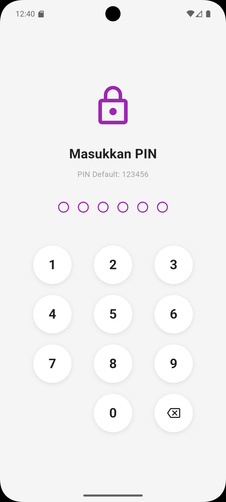
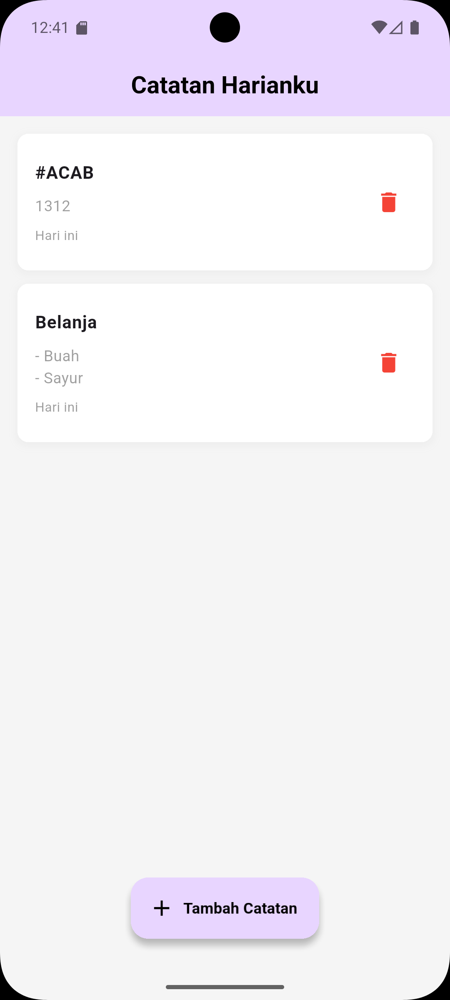
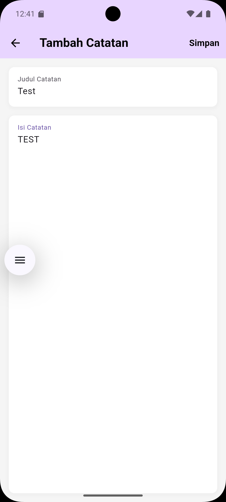

# 📱 MyNote - Aplikasi Catatan Harian

**Pembuat:** Dwi Ahmad Khairy

Aplikasi catatan harian yang dibuat menggunakan Flutter dengan fitur keamanan PIN dan penyimpanan lokal SQLite.

## 🎯 Deskripsi

MyNote adalah aplikasi mobile yang memungkinkan pengguna untuk mencatat dan mengelola catatan harian mereka dengan mudah. Aplikasi ini dilengkapi dengan sistem keamanan PIN untuk melindungi privasi pengguna dan interface yang user-friendly.

## ✨ Fitur Utama

### 🔐 Keamanan PIN
- PIN default: `123456`
- Autentikasi wajib saat pertama kali membuka aplikasi
- Sistem auto-lock setelah aplikasi tidak aktif selama 30 detik
- PIN akan diminta kembali jika aplikasi di-pause lebih dari 30 detik

### 📝 Manajemen Catatan (CRUD)
- **Create**: Tambah catatan baru dengan judul dan isi
- **Read**: Lihat daftar semua catatan dengan tampilan yang rapi
- **Update**: Edit catatan yang sudah ada
- **Delete**: Hapus catatan dengan konfirmasi

### 💾 Penyimpanan Data
- Database SQLite lokal untuk penyimpanan offline
- Data tersimpan permanen di perangkat
- Timestamp otomatis untuk setiap catatan (dibuat dan diperbarui)

### 🎨 User Interface
- Desain modern dengan tema warna ungu yang elegan
- Card-based layout untuk setiap catatan
- Shadow effects untuk visual yang menarik
- Responsive design yang nyaman digunakan

## 🏗️ Arsitektur Aplikasi

```
lib/
├── main.dart                    # Entry point aplikasi
├── models/
│   └── note.dart               # Model data catatan
├── helpers/
│   └── database_helper.dart    # Database operations (SQLite)
├── services/
│   └── security_service.dart   # Manajemen keamanan PIN
├── widgets/
│   └── auth_wrapper.dart       # Wrapper untuk autentikasi
└── pages/
    ├── pin_page.dart           # Halaman input PIN
    ├── notes_list_page.dart    # Halaman daftar catatan
    └── add_edit_note_page.dart # Halaman tambah/edit catatan
```

## 🚀 Cara Menjalankan

### Prasyarat
- Flutter SDK (versi 3.8.1 atau lebih baru)
- Android Studio / VS Code dengan ekstensi Flutter
- Android Emulator atau perangkat Android untuk testing

### Langkah Instalasi

1. **Clone repository**
   ```bash
   git clone https://github.com/Archin0/MyNotes.git
   cd mynote
   ```

2. **Install dependencies**
   ```bash
   flutter pub get
   ```

3. **Jalankan aplikasi**
   ```bash
   flutter run
   ```

## 📦 Dependencies

| Package | Versi | Kegunaan |
|---------|-------|----------|
| `sqflite` | ^2.3.0 | Database SQLite untuk penyimpanan lokal |
| `path` | ^1.8.3 | Utilities untuk path management |
| `cupertino_icons` | ^1.0.8 | Icon set untuk Flutter |

## 📱 Screenshots & Demo

### 📸 Preview Aplikasi

<div align="center">

| Halaman PIN | Daftar Catatan | Tambah/Edit Catatan |
|-------------|----------------|---------------------|
|  |  |  |
| Masukkan PIN untuk akses aplikasi | Tampilan daftar catatan harian | Form untuk menambah/edit catatan |

</div>

### 🎥 Fitur Utama

<div align="center">

| Keamanan PIN | CRUD Operations | Local Storage |
|-------------|-----------------|---------------|
|  |  |  |
| Auto-lock setelah 30 detik inaktif | Tambah, edit, hapus catatan | Data tersimpan lokal dengan SQLite |

</div>

### 📋 Detail Screenshot

#### Halaman PIN
- Interface numpad yang intuitif dengan animasi
- Indikator visual dots untuk input PIN
- Animasi shake untuk PIN yang salah
- PIN default: **123456**

#### Halaman Daftar Catatan
- Layout card yang modern dengan shadow
- Timestamp relatif (Hari ini, Kemarin, dll.)
- Tombol floating action untuk menambah catatan
- Icon delete merah untuk menghapus catatan

#### Halaman Tambah/Edit
- Form validation untuk judul dan isi catatan
- Auto-save dengan loading indicator
- Interface yang bersih dan mudah digunakan
- Tombol simpan di header

> **📝 Catatan**: Gambar-gambar di atas akan ditambahkan setelah aplikasi di-build dan dijalankan. 
> Silakan lihat folder `img/` untuk panduan lengkap pengambilan screenshot.

## 🔒 Keamanan

Aplikasi mengimplementasikan beberapa fitur keamanan:

1. **PIN Protection**: Akses aplikasi dilindungi dengan PIN 6 digit
2. **Session Management**: Otomatis logout setelah periode inaktif
3. **Local Storage**: Data disimpan secara lokal tanpa transmisi ke server
4. **Lifecycle Monitoring**: Aplikasi memantau state lifecycle untuk keamanan

## 🛠️ Pengembangan

### Struktur Kode
- **Model**: Representasi data menggunakan Dart classes
- **Helper**: Utility functions untuk database operations
- **Service**: Business logic untuk fitur-fitur aplikasi
- **Widget**: Reusable UI components
- **Pages**: Screen-level widgets untuk setiap halaman

### Best Practices
- Clean Architecture pattern
- Separation of concerns
- Error handling yang proper
- Responsive design principles

## 📝 Catatan Pengembang

Aplikasi ini dikembangkan sebagai contoh implementasi aplikasi catatan sederhana dengan fokus pada:
- Kemudahan penggunaan
- Keamanan data pengguna
- Performance yang optimal
- Code maintainability

## 🤝 Kontribusi

Kontribusi selalu diterima! Silakan:

### 💻 Untuk Kode
1. Fork repository ini
2. Buat feature branch (`git checkout -b feature/AmazingFeature`)
3. Commit perubahan (`git commit -m 'Add some AmazingFeature'`)
4. Push ke branch (`git push origin feature/AmazingFeature`)
5. Buat Pull Request

### 📸 Untuk Gambar/Screenshot
1. Jalankan aplikasi di perangkat atau emulator
2. Ambil screenshot sesuai panduan di folder `img/`
3. Upload gambar dengan nama file yang sesuai
4. Pastikan kualitas gambar baik dan readable
5. Buat Pull Request dengan deskripsi yang jelas

### 📋 Checklist Kontribusi Gambar
- [ ] Screenshot halaman PIN (`pin_page.png`)
- [ ] Screenshot daftar catatan (`notes_list.png`) 
- [ ] Screenshot tambah/edit catatan (`add_edit_note.png`)
- [ ] GIF demo keamanan (opsional)
- [ ] GIF demo CRUD operations (opsional)

## 📄 Lisensi

Distributed under the MIT License. See `LICENSE` for more information.

---

**Dibuat dengan ❤️ oleh Dwi Ahmad Khairy**
